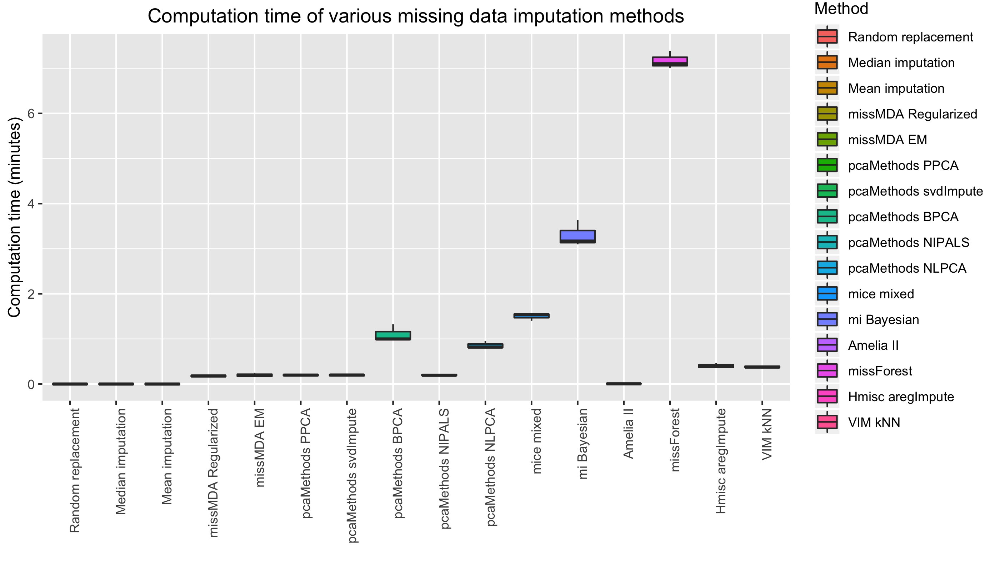
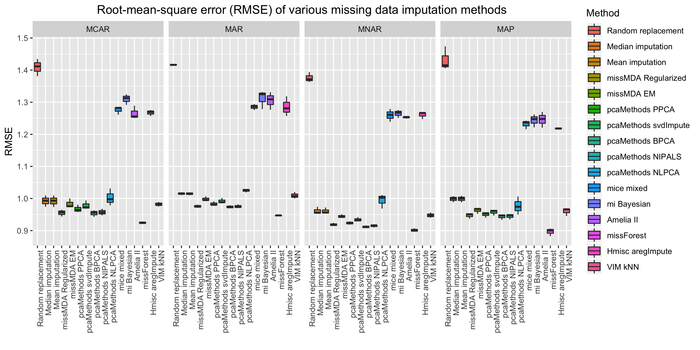
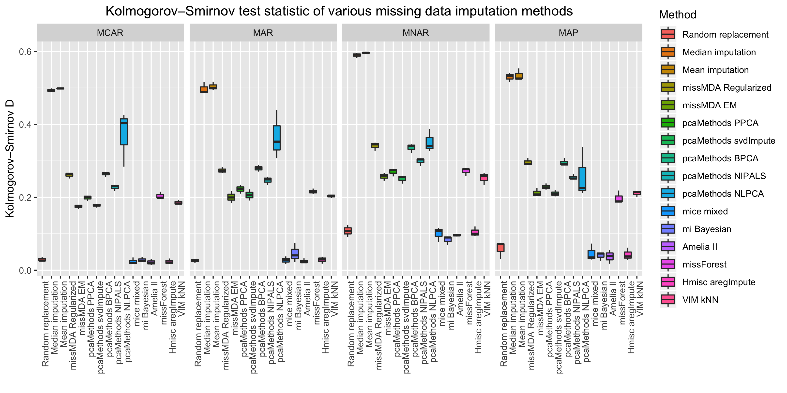

<!-- rmarkdown v1 -->

[](https://www.repostatus.org/#active)
[](http://choosealicense.com/licenses/mit/)
[](https://travis-ci.com/Tirgit/missCompare)
[](https://cran.rstudio.com/web/packages/missCompare/index.html)
 
---
 
[](https://cran.r-project.org/)
[](https://cran.r-project.org/package=missCompare)
[](commits/master)
 

<!-- README.md is generated from README.Rmd. Please edit that file -->


# Overview of missCompare

**missCompare** is a missing data imputation pipeline that will guide you through your missing data problem. A range of functions will help you select what could be the most ideal algorithm for your data and provide an easy way to impute missing datapoints in your dataset.    

## The missCompare pipeline

You will find a detailed manual in the missCompare vignette:

```r
install.packages("missCompare")
library(missCompare)
vignette("misscompare")
```

1. **Cleaning your data** using `missCompare::clean()`
2. **Extracting information** on dimensions, missingness, correlations and variables, plotting
missing data using `missCompare::get_data()`
3. **Imputation - simulated data**:
  + simulating full data with no missingness using metadata from the previous step (resembling your original data) using `missCompare::simulated()`
  + spiking in missing data in distinct missing data patterns using `missCompare::all_patterns()`. These patterns are:
    + missing completely at random (MCAR) - `missCompare::MCAR()` - missing data occurrence random
    + missing at random (MAR) - `missCompare::MAR()` - missing data occurrence correlates with other variables' values (univariate solution in missCompare)
    + missing not at random (MNAR) - `missCompare::MNAR()` - missing data occurrence correlates with variables' own values
    + missing in assumed pattern (MAP) - `missCompare::MAP()` - a combination of the previous three, where the user can define a pattern per variable
  + imputing missing data, obtaining imputation metrics (root mean squared errors - RMSE, mean absolute error - MAE, Kolmogorov-Smirnov test statistic D for equal distributions, computation time) per method and plotting results using `missCompare::impute_simulated()`
4. **Imputing your data** -  After the previous step, you will have a general idea about what are the best performing algorithms for your data structure (size, degree of correlation between variables). In this step, you can impute your original data with your chosen algorithm(s) using `missCompare::impute_data()`
5. **Post imputation diagnostics** will give an informative assessment on how the imputation changed your data structure (e.g. variable means, distributions, clusters, correlations). The function here is `missCompare::post_imp_diag()`

## Installation

You can install the released version of missCompare from [CRAN](https://CRAN.R-project.org) with:

``` r
install.packages("missCompare")
```

## Usage

### Loading library and sandbox data

```r
library(missCompare)
data("clindata_miss")
```

### Cleaning

```r
cleaned <- missCompare::clean(clindata_miss,
                              var_removal_threshold = 0.5, 
                              ind_removal_threshold = 1,
                              missingness_coding = -9)
```

### Extracting data

```r
metadata <- missCompare::get_data(cleaned,
                                  matrixplot_sort = T,
                                  plot_transform = T)
```

### Imputation - simulation framework

```r
missCompare::impute_simulated(rownum = metadata$Rows,
                              colnum = metadata$Columns, 
                              cormat = metadata$Corr_matrix,
                              MD_pattern = metadata$MD_Pattern,
                              NA_fraction = metadata$Fraction_missingness,
                              min_PDM = 10,
                              n.iter = 50, 
                              assumed_pattern = NA)
```

#### Computation time comparison



#### RMSE comparison



#### KS comparison



### Imputation of data

```r
imputed <- missCompare::impute_data(cleaned, 
                         scale = T, 
                         n.iter = 10, 
                         sel_method = c(1:16))
```
                         
### Post imputation diagnostics

```r
diag <- missCompare::post_imp_diag(cleaned,
                                   imputed$mean_imputation[[1]],
                                   scale=T, 
                                   n.boot = 100)
```

#### Post imputation diagnostics - distributions of original and imputed values for a random variable


#### Post imputation diagnostics - variable clusters in the original and imputed datasets


#### Post imputation diagnostics - comparison of variable-pair correlations


## Issues, questions

In case you need help or advice on your missing data problem or you need help with the missCompare package, please e-mail the authors. If you would like to report an issue, please do so in a reproducible example at the [missCompare GitHub](https://github.com/Tirgit/missCompare/issues) page.

