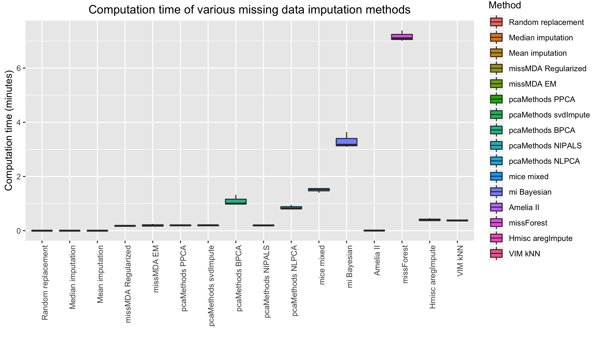
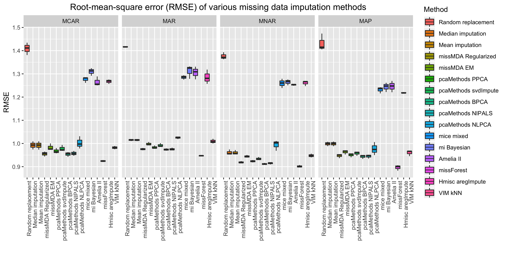
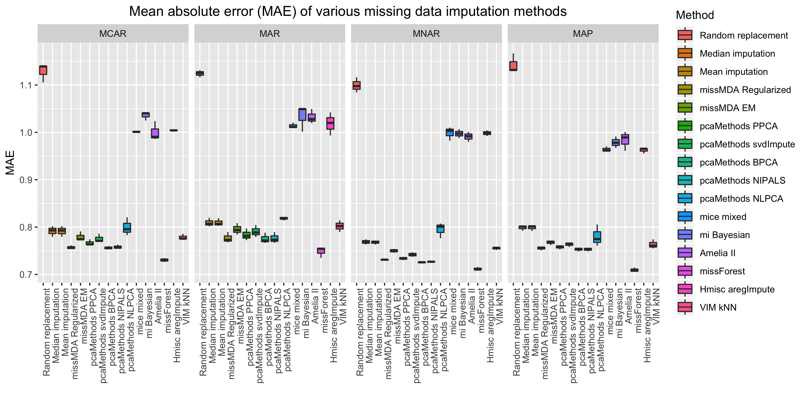
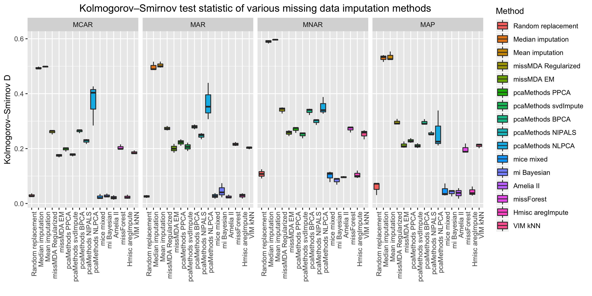

---
title: "Introduction to missCompare"
author: "Tibor V. Varga"
date: "`r Sys.Date()`"
output: rmarkdown::html_vignette
vignette: >
  %\VignetteIndexEntry{missCompare}
  %\VignetteEngine{knitr::rmarkdown}
  %\VignetteEncoding{UTF-8}
  %\VignetteDepends{devtools}
---

```{r setup, include = FALSE}
knitr::opts_chunk$set(
  collapse = TRUE,
  comment = "#>"
)
library(missCompare)
```


If you work with data, you have almost certainly encountered issues regarding missing data. The most commonly used statistical methods often only work with complete sets of observations and it can be a huge pain when you realize that you can only utilize a fraction of your data because of missing datapoints here and there. Indeed, just 5\% random missing data in a huge dataset can dramatically reduce the number of complete observations to as low as 25\% of the original number of observations! Scary! Thankfully, there are numerous algorithms that can help you tackle this issue, but often, the most commonly used methods, such as mean and median imputation, offer suboptimal solutions and sophisticated algorithms often need a lot of consideration and background knowledge. The authors wrote the missCompare package to help you through your missing data problem. The initial hypothesis of the authors was that **datasets with different parameters (size, distributions, correlations, etc.) will benefit differently from various missing data imputation algorithms**.

This tutorial will navigate you through the missCompare package and its functions. So... let's start.

First, let's begin by installing and loading the missCompare package!

```{r eval = FALSE}
install.packages("missCompare")
library(missCompare)
```


## Description of data: *clindata_miss*

To walk you through the missCompare missing data imputation pipeline, the authors created
the `missCompare::clindata_miss` dataframe. As the name suggest, clindata_miss contains missing data. You can load this dataframe into your workspace by:

```{r eval = TRUE}
data("clindata_miss")
```

The data is created by the authors with the purpose of generating a dataset that resembles real-life
data with variables generally available in a simple, realistic clinicial epidemiology dataset. This R dataframe
have realistic variable means, distributions, correlations and missing data patterns. You can find further information
on the dataframe using `?clindata_miss`.


## The missCompare pipeline

The missCompare pipeline is comprised of the following steps:

1. **Cleaning your data** using `missCompare::clean()`
2. **Extracting information** on dimensions, missingness, correlations and variables, plotting
missing data using `missCompare::get_data()`
3. **Imputation - simulated data**:
  + simulating full data with no missingness using metadata from the previous step (resembling your original data) using `missCompare::simulated()`
  + spiking in missing data in distinct missing data patterns using `missCompare::all_patterns()`. These patterns are:
    + missing completely at random (MCAR) - `missCompare::MCAR()` - missing data occurence random
    + missing at random (MAR) - `missCompare::MAR()` - missing data occurence correlates with other variables' values
    + missing not at random (MNAR) - `missCompare::MNAR()` - missing data occurence correlates with variables' own values
    + missing in assumed pattern (MAP) - `missCompare::MAP()` - a combination of the previous three, where the user can define a pattern per variable
  + imputing missing data, obtaining measures of imputation quality (root mean squared error - RMSE; mean absolute error - MAE;
  Kolmogorov–Smirnov test statistic - KS; computation time) per method and plotting results using `missCompare::impute_simulated()`
4. **Imputing your data** - After the previous step, you will have a general idea on what are the best performing algorithms for your data structure (size, degree of correlation between variables). In this step you can impute your original data with your chosen algorithm(s) using `missCompare::impute_data()`
5. **Post imputation diagnostics** will give an informative assessment on how the imputation changed your data structure (e.g. variable means, distributions, correlations). The function here is `missCompare::post_imp_diag()`.

Now let's look into these, step by step!

## Cleaning and getting to know the data

The first step before starting anything imputation related is getting to know your data and cleaning it if necessary. This is not an "automated" process, nor should it be. You always need to explore your data before missing data imputation - it is entirely up to you what to keep and what to drop from your dataset before the imputation process. After the cleaning steps, missCompare will essentially reconstruct your dataset with no missing data, and in order to achieve this, your dataframe cannot have variables of type character or factor (in a later stage you will be able to use your original factor variables, but to extract metadata at this step, a conversion is necessary). 

Let's take clindata_miss and run `missCompare::clean()`. In one step, you can achieve multiple cleaning steps:

```{r eval = TRUE} 
cleaned <- missCompare::clean(clindata_miss,
                              var_removal_threshold = 0.5, 
                              ind_removal_threshold = 0.8,
                              missingness_coding = -9)
```

* You can convert all factor variables (sex and education, in this case) to numeric. The function will alert you with a message: **"Variable(s) sex, education converted to numeric."**
* You can remove variables exceeding a set threshold (default is 50\%, but this is up to you, you can set it lower or higher). In other words, you can discard those variables where lots of data are missing. Such variables can only be imputed with low accuracy, so the authors suggest that you remove variables with high missingness fraction, but there is no recipe for this, e.g. you will find no guidelines on whether 50\% is too high or too low, the threshold will be YOUR decision. In case there is a variable removed here, the function will alert you with a message: **Variable(s) PPG removed due to exceeding the pre-defined removal threshold (>50%) for missingness.**
* Similarly, you can remove individuals with a high percentage of missing values (default is 100\%, but this is up to you, you can set it lower). In other words, you can discard those observations that have only missing datapoints (these will be totally uninformative for imputation), or those with lots of missing data points. Again, there are no guidelines here, the threshold is ultimately YOUR decision. In this case, we set this threshold to 0.8, and the function alerted us with a message: **1 individual(s) removed due to exceeding the pre-defined removal threshold (>80%) for missingness.**
* In some datasets, missing values can be coded in a weird way. In clindata_miss, we emulated a real-life scenario where lipid values were set to **-9** when measured below the sensitivity of a hypothetical machine. The cleaning function will let you convert pre-defined values to **NAs**.

The cleaning function outputs a dataframe called `cleaned`. In the next step, where you extract important metadata from your dataframe, you will continue working with this object.

You will get to know important details of your cleaned dataframe using the following line:

```{r eval = TRUE} 
metadata <- missCompare::get_data(cleaned,
                                  matrixplot_sort = T,
                                  plot_transform = T)
```

If there are non-numeric variables in the data, a warning will appear: **Warning! Variable(s) sex, education is/are not numeric. Convert this/these variables to numeric using missCompare::clean() and repeat the missCompare::get_data() function until no warnings are shown.**

As we cleaned clindata_miss in the previous step, the function should run without any warnings and errors. The output object, `metadata` is a list of the following elements.

* `metadata$Complete_cases` - the number of complete observations with no missing data. In this case, there are **1349 observations from the original 2500** with no missing data. Note, that with only ~7\% missing data, the number of complete observations is dramatically decreased to around half of the original data. As many methods (e.g. regression, principal component analysis, etc.) require complete sets of observations, this decrease in complete observations presents a very strong case for missing data imputation.
* `metadata$Rows` and `metadata$Columns` give you the dimensions of the dataframe, **2499 rows and 11 columns**, in our case.
* `metadata$Corr_matrix` - gives you the **correlation matrix of all variables** in the dataframe. The function assesses pairwise Pearson correlation coefficients using complete sets of pairs between any two variables. For example there are 2312 complete BMI-waist pairs (`sum(!is.na(cleaned$BMI) & !is.na(cleaned$waist))`) - in this case correlation will be calculated based on these 2312 value pairs, even though the number of complete observations (no NAs for any variables) is 1349. This way all of the data will be utilized to obtain the most accurate correlation coefficients.
* `metadata$Fraction_missingness` and `metadata$Fraction_missingness_per_variable` return the the total fraction of missingness in the dataframe and the fraction of missingness per variable, respectively. In our case, the **total fraction of missingess is 6.9\%** after removing one variable, PPG with >50\% missing. Inspecting the fraction of missingness per variable it is also apparent that the true missing data fraction of TG and HDL-C after converting -9s to NAs are 10.6\% and 13.7\%, respectively.
* `metadata$Total_NA` and `metadata$NA_per_variable` return the total number of missing values in the dataframe and per variable.
* `metadata$MD_Pattern` - The missing data pattern is calculated using mice::md.pattern (`?mice::md.pattern`).
* `metadata$NA_Correlations` - Pairwise correlation point-biserial correlation coefficients between variable pairs. Namely, for each calculation, variables are converted to TRUE/FALSE based on missing data status (missing or not missing) and these boolean vectors and correlated to the native variables. The resulting correlation matrix has rows with variable names + _is.na - the rows represent the converted variables, while the columns are the original variables.
* `metadata$min_PDM_thresholds` - This object is a small dataframe that informs about the various min_PDM (minimum number of observations per distinct missing data pattern) values. min_PDM will need to be defined in further functions, so it is informative to get a sense on what is the proportion of missing data patterns that should be used in the simulation framework. In the table below we see that if this number is too high (only those missing data patterns are considered that describe 100 or more observations) than more than 80\% of observations with other missing data patterns will be ignored in the simulation framework. On the other hand, if this number is set too low, e.g. below 5, than this may result in retaining almost all missing data patterns that are applicable to only a few observations. Therefore, this number will need to be set carefully later. This table shows approximate percentages of observations with missing data retained with setting min_PDM in later steps.
```{r echo = FALSE, fig.width=6, fig.height=3} 
metadata$min_PDM_thresholds
```
* `metadata$Vars_above_half` - In case there are variables exceeding 50\% missingness, this object will list these variables and the function will output a warning: **Warning! Missingness exceeds 50% for variable(s) PPG. Although the pipeline will function with variables with high missingness, consider excluding these variables using missCompare::clean() and repeating function until no warnings are shown.**
* `metadata$Matrix_plot` - Matrix plot (ggplot2 object) visualizing **missing data distribution**. Missing data are represented by gray color, while data is colored by value. There are options to sort the dataframe by missingness or leave the dataframe unsorted. This plot (hopefully) gives you a visual description of how data is missing together and what fraction of the data is missing.     
```{r echo = FALSE, fig.width=6, fig.height=3} 
metadata$Matrix_plot
```
* `metadata$Cluster_plot` - Dendrogram (ggplot2 object) visualizing the **hierarchical clustering of missing data**. On the plot, the clades (bifurcations) closer to Height 0 (the bottom of the plot) represent closer relationships in terms of missing data - i.e. those variables in one group are more likely to be missing together compared to the rest. In our case, blood pressures SBP and DPB are missing together often and so as the three lipid traits, TC, TG and HLD-C. With respect to the other variables, waist and BMI have a closer relationship compared to the rest.    
```{r echo = FALSE, fig.width=6, fig.height=3} 
metadata$Cluster_plot
```


## Simulating a complete dataset and assessing algorithms

Having learned the characteristics of your data, the next step is to assemble a framework in which you can test the performance of various missing data algorithms on simulated data. This can be achieved in one step using `missCompare::impute_simulated()`, but let's look under the hood and see how this function is operating in the background. You can access these functions in case you would like to play with parameters.    

First, `missCompare::simulate()` will create a dataset that resembles your original dataframe, but with no missing data. The dimensions of the simulated dataframe and all correlations between variables will match the original data - essentially, the only major difference between the simulated dataset and your original data is that here, all variables are normally distributed with a custom set mean and standard deviation. Let's observe:

```{r eval = FALSE} 
simulated <- missCompare::simulate(rownum = metadata$Rows,
                                   colnum = metadata$Columns,
                                   cormat = metadata$Corr_matrix,
                                   meanval = 0,
                                   sdval = 1)
```

Note how the first three arguments are elements of the output list (`metadata`) from the previous function `missCompare::get_data()`.

The output `simulated` is a list, where the first item is the simulated matrix and the next two objects are samples from the correlation matrix of the original and the simulated data.

With this done, missing data can be spiked in in the simulated data using various patterns (MCAR, MAR, MNAR and MAP). This will be done with respect to the missing data fraction for each variable in the original dataframe.

MCAR missingness is simple, NAs are spiked in randomly:
```{r eval = FALSE} 
missCompare::MCAR(simulated$Simulated_matrix,
             MD_pattern = metadata$MD_Pattern,
             NA_fraction = metadata$Fraction_missingness,
             min_PDM = 10)
```

MAR and MNAR missingness follow similar logic. With MNAR, NAs are spiked in based on the variable's own values, while with MAR, NAs are spiked in based on all other variables' values.
```{r eval = FALSE} 
missCompare::MAR(simulated$Simulated_matrix,
             MD_pattern = metadata$MD_Pattern,
             NA_fraction = metadata$Fraction_missingness,
             min_PDM = 10)

missCompare::MNAR(simulated$Simulated_matrix,
             MD_pattern = metadata$MD_Pattern,
             NA_fraction = metadata$Fraction_missingness,
             min_PDM = 10)
```

MAP missingness is a possible combination of any of the previous three missing data pattern. You can define what pattern you assume per variable. In our case, let's say that all variables are missing randomly, except for education (the last variable), which is missing not at random. This can be defined as:
```{r eval = FALSE} 
missCompare::MAP(simulated$Simulated_matrix,
             MD_pattern = metadata$MD_Pattern,
             NA_fraction = metadata$Fraction_missingness,
             min_PDM = 10,
             assumed_pattern = c(rep("MCAR", 10), "MNAR"))
```

All patterns can be run with a single line using `missCompare::all_patterns()`.

Again, `missCompare::impute_simulated()` does all these in one step, and more:     
1. it simulates the dataset with no missing values;     
2. spikes in NAs in MCAR, MAR, MNAR and - if you define a custom pattern - MAP patterns;     
3. imputes missing data using a curated list of 16 algorithms;     
4. evaluates imputation accuracy by calculating RMSE, MAE and KS values between the imputed and the original datapoints.

This can be achieved by a single command! This means you DON'T have to run `missCompare::simulate()`, `missCompare::MCAR()`, `missCompare::MAR()`, `missCompare::MNAR()`, `missCompare::MAP()` or `missCompare::all_patterns()`. The command goes as (note that we defined `assumed_pattern = NA` - the defeault - so MAP pattern will be skipped):

```{r eval = FALSE} 
missCompare::impute_simulated(rownum = metadata$Rows,
                              colnum = metadata$Columns, 
                              cormat = metadata$Corr_matrix,
                              MD_pattern = metadata$MD_Pattern,
                              NA_fraction = metadata$Fraction_missingness,
                              min_PDM = 10,
                              n.iter = 50, 
                              assumed_pattern = NA)
```

The `n.iter` argument controls how many times the process will repeat itself (spiking in missing data, imputation and assessment of imputation accuracy, that is).

When this is completed (depending on the size of you data, it can take some time!), you should get messages stating what are the best performing algorithms for each missingness patterns (evaluated by various metrics) and a graph that gives you a visual aid on which algorithms perform in the most desired fashion. The less the error, and the more the imputed values' distributions match the original values' distributions, the better!


## Computation time comparison



## RMSE comparison



## MAE comparison



## KS comparison


## Imputing your dataset

Hopefully, by now you have a good idea on which method you would like to use to impute missing data for your dataset - you will be able to do this using `missCompare::impute_data()`. Let's consider a scenario where you choose **missForest** to impute your data. You do not want to scale your data and you would like to create 10 imputed dataframes in order to set up a multiple imputation framework. Note, that setting up a multiple imputation framework is only a viable option with probabilistic models (e.g. you can impute you data with **Mean imputation** a billion times, but the NAs will always be replaced with exacty the same mean values!).

```{r eval = FALSE} 
imputed <- missCompare::impute_data(cleaned, 
                         scale = F, 
                         n.iter = 10, 
                         sel_method = c(14)) # 14 is the code for missForest
```

The 10 imputed dataframes will be available under `imputed$missForest_imputation[[1]]`, `imputed$missForest_imputation[[2]]`, `imputed$missForest_imputation[[3]]`, etc..., while all the other elements in the list will be empty (e.g. nothing in `imputed$median_imputation`).

Let's see what happens when you similarly define 10 copies, but choose a non-probabilistic method - **Mean imputation** in this case.

```{r eval = TRUE, message = FALSE} 
imputed <- missCompare::impute_data(cleaned, 
                         scale = T, 
                         n.iter = 10, 
                         sel_method = c(3)) # 3 is the code for mean imputation
```

You will see that the algorithm runs only 1 iteration for **Mean imputation**, and there is only one object, under `imputed$mean_imputation[[1]]`. There are no `imputed$mean_imputation[[2]]`, `imputed$mean_imputation[[3]]`, etc... created at all.

Well done! You have imputed your data. Almost there, only one step remains - to assess how the imputation affected your dataset.

## Post imputation diagnostics

The function `missCompare::post_imp_diag()` will help you assess how the imputation affected important parameters of your data.

Let's run this with the results of the **Mean imputation** algorithm (`imputed$mean_imputation[[1]]`):

```{r eval = TRUE} 
diag <- missCompare::post_imp_diag(cleaned,
                                   imputed$mean_imputation[[1]], 
                                   scale=F, 
                                   n.boot = 5)
```

The `diag` list contains several interesting assessments. The `Densityplots` and `Boxplots` lists should give an idea on the distributions of the original and the imputed values. Perhaps the limitations of mean imputation are the most apparent on these plots. For example, let's inspect HDL levels on this boxplot:

```{r echo = FALSE, fig.width=6, fig.height=3} 
diag$Boxplots$HDL
```

The `Barcharts` list only contains elements if there were factors in the original data. 

The `Statistics` list shows the mean and SD values for the original and imputed values per variables and calculates Welch's t test on the two groups of values.

The `Variable_clusters_orig` and `Variable_clusters_imp` plots visualize the clusters of variables before and after the imputation. The clusters should not change too much!

```{r echo = FALSE, fig.width=6, fig.height=3} 
diag$Variable_clusters_imp
```

Finally, the `Correlation_plot` shows bootstrapped correlation coefficients from the original data and the imputed data. You can specify how many iterations you would like to run to obtain bootstrapped correlation coefficients and 95\% confidence intervals using the `n.boot` argument in the function. In this vignette this is set to 5, which is far too low. The blue line has intercept 0 and slope 1 and  correlation coefficients (represented by the dots and the red line) should align this line as much as possible. With mean and median imputations, the line is often "turned clockwise", with a lower slope than 1 (regression to the mean).

```{r echo = FALSE, fig.width=6, fig.height=3} 
diag$Correlation_plot
```

## Closing words

Well done!
You completed the tutorial and by now, you should ideally have one or more imputed datasets of your data. Awesome job! We hope that you achieved what you were set out to do and you are ready for the next stes in your statistical analysis! Please let us know if you have any issues here -  [missCompare GitHub](https://github.com/Tirgit/missCompare/issues) - or contact the authors if you have any feedback!

 -- authors of missCompare
